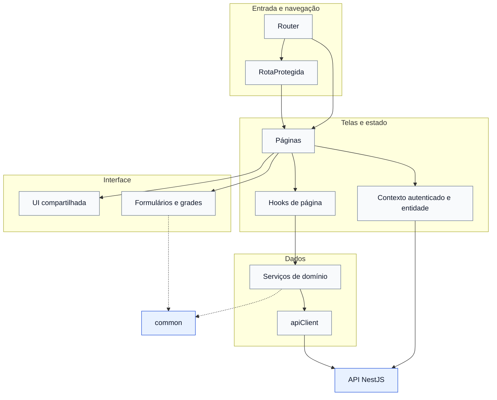
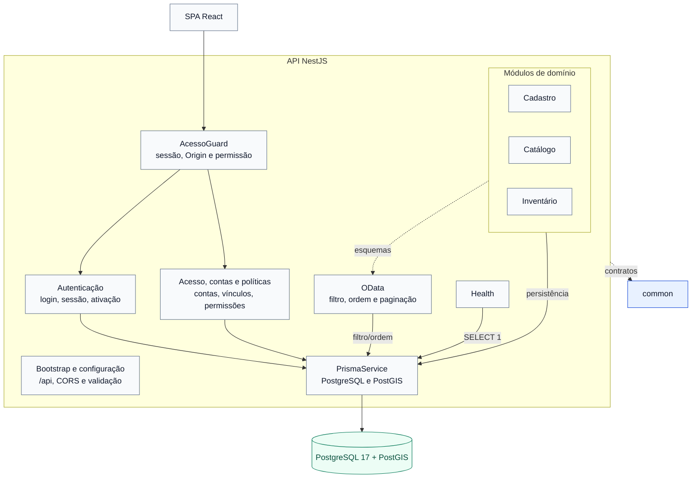
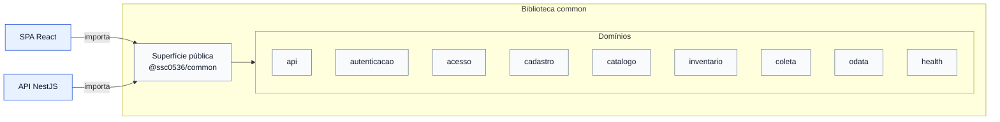

# Componentes

As visões usam Mermaid flowchart para manter a leitura. Os níveis C4 orientam a organização.

## Frontend

```mermaid
flowchart TB
    subgraph ENTRADA["Entrada e navegação"]
        router["Router"]
        guarda["RotaProtegida"]
    end

    subgraph TELAS["Telas e estado"]
        paginas["Páginas"]
        contexto["Contexto autenticado e entidade"]
        hooks["Hooks de página"]
    end

    subgraph DADOS["Dados"]
        servicos["Serviços de domínio"]
        http["apiClient"]
    end

    subgraph INTERFACE["Interface"]
        form["Formulários e grades"]
        ui["UI compartilhada"]
    end

    api["API NestJS"]
    common["common"]

    router --> paginas
    router --> guarda
    guarda --> paginas
    paginas --> contexto
    paginas --> hooks
    hooks --> servicos
    servicos --> http
    http --> api
    contexto --> api
    paginas --> form
    paginas --> ui
    servicos -.-> common
    form -.-> common

    classDef componente fill:#f8fafc,stroke:#64748b,color:#0f172a
    classDef externo fill:#e8f1ff,stroke:#1d4ed8,color:#0f172a
    class router,guarda,paginas,contexto,hooks,servicos,http,form,ui componente
    class api,common externo
```

## Backend

```mermaid
flowchart TB
    spa["SPA React"]

    subgraph API["API NestJS"]
        bootstrap["Bootstrap e configuração<br/>/api, CORS e validação"]
        guard["AcessoGuard<br/>sessão, Origin e permissão"]
        auth["Autenticação<br/>login, sessão, ativação"]
        acesso["Acesso, contas e políticas<br/>contas, vínculos, permissões"]
        subgraph DOMINIOS["Módulos de domínio"]
            cadastro["Cadastro"]
            catalogo["Catálogo"]
            inventario["Inventário"]
        end
        odata["OData<br/>filtro, ordem e paginação"]
        prisma["PrismaService<br/>PostgreSQL e PostGIS"]
        health["Health"]
    end

    common["common"]
    banco[("PostgreSQL 17 + PostGIS")]

    spa --> guard
    guard --> auth
    guard --> acesso
    auth --> prisma
    acesso --> prisma
    DOMINIOS -->|"persistência"| prisma
    odata -->|"filtro/ordem"| prisma
    health -->|"SELECT 1"| prisma
    prisma --> banco
    DOMINIOS -.->|"esquemas"| odata
    API -.->|"contratos"| common

    classDef componente fill:#f8fafc,stroke:#64748b,color:#0f172a
    classDef externo fill:#e8f1ff,stroke:#1d4ed8,color:#0f172a
    classDef database fill:#ecfdf5,stroke:#047857,color:#064e3b
    class spa,bootstrap,guard,auth,acesso,cadastro,catalogo,inventario,odata,prisma,health componente
    class common externo
    class banco database
```

## Contratos compartilhados

```mermaid
flowchart LR
    spa["SPA React"]
    apiApp["API NestJS"]

    subgraph COMMON["Biblioteca common"]
        surface["Superfície pública<br/>@ssc0536/common"]
        subgraph DOMINIOS["Domínios"]
            api["api"]
            autenticacao["autenticacao"]
            acesso["acesso"]
            cadastro["cadastro"]
            catalogo["catalogo"]
            inventario["inventario"]
            coleta["coleta"]
            odata["odata"]
            health["health"]
        end
    end

    spa -->|"importa"| surface
    apiApp -->|"importa"| surface
    surface --> DOMINIOS

    classDef componente fill:#f8fafc,stroke:#64748b,color:#0f172a
    classDef externo fill:#e8f1ff,stroke:#1d4ed8,color:#0f172a
    class surface,api,autenticacao,acesso,cadastro,catalogo,inventario,coleta,odata,health componente
    class spa,apiApp externo
```
